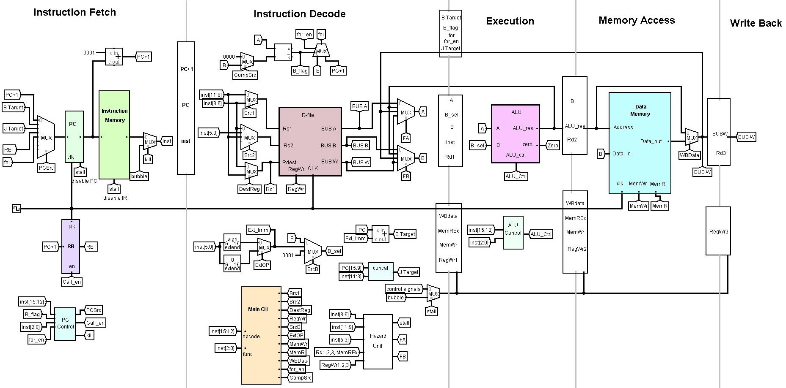

# ⚙️ 16-bit Pipelined RISC Processor

A fully functional **16-bit pipelined RISC CPU** designed and implemented from scratch in Verilog HDL. This processor features a classic **4-stage pipeline** (Fetch → Decode → Execute → Memory/Writeback), complete with data hazard detection, forwarding logic, branch handling, and a built-in performance monitoring unit.

> **Course Project** — Computer Organization & Architecture  
> **Contributors:** Joud Thaher · Labiba Sharia · Amir Al-Rashayda

---

## 🏗️ Architecture Overview

```
┌─────────┐    ┌─────────┐    ┌─────────┐    ┌──────────────┐
│  FETCH  │ →  │ DECODE  │ →  │ EXECUTE │ →  │ MEM / WB     │
│  (IF)   │    │  (ID)   │    │  (EX)   │    │              │
│         │    │         │    │         │    │              │
│ PC + 1  │    │ RegFile │    │   ALU   │    │ Data Memory  │
│ Inst.   │    │ Control │    │ Forward │    │ Write-Back   │
│ Memory  │    │ Hazard  │    │ Unit    │    │              │
└─────────┘    └─────────┘    └─────────┘    └──────────────┘
                     ↕ Hazard / Forwarding Unit ↕
```



---

## ✨ Features

| Feature | Details |
|---|---|
| **Word Width** | 16-bit |
| **Architecture** | RISC, Harvard memory model |
| **Pipeline Stages** | 4-stage (IF → ID → EX → MEM/WB) |
| **ISA** | Custom — 10 instruction types |
| **Hazard Handling** | Full forwarding unit + load-use stall detection |
| **Branch Support** | BEQ, BNE with early comparator in Decode |
| **Jump & Call** | JMP, CALL, RET with return-address register |
| **Loop Hardware** | Dedicated `FOR` instruction with hardware loop counter |
| **Register File** | 8 × 16-bit general-purpose registers (R0 hardwired to 0) |
| **ALU Operations** | AND, ADD, SUB, SLL, SRL |
| **Performance Monitor** | Counts total / load / store / ALU / control instructions + stall cycles |
| **Simulation** | Icarus Verilog compatible; waveform-ready (`.asdb`) |

---

## 📁 Repository Structure

```
16-bit-pipelined-risc-cpu/
│
├── src/
│   ├── core/
│   │   ├── CPU.v           # Top-level CPU module (datapath + controller)
│   │   ├── datapath.v      # Full 4-stage pipelined datapath
│   │   ├── opcodes.v       # ISA opcode definitions
│   │   └── functions.v     # ALU function code definitions
│   │
│   ├── controller/
│   │   └── controller.v    # Main control unit, PC control, ALU control, pipeline registers
│   │
│   ├── memory/
│   │   └── memories.v      # Instruction Memory & Data Memory modules
│   │
│   └── utils/
│       └── basic_components.v  # ALU, RegFile, MUXes, Adder, Comparator, Extender, Flip-flops
│
├── tb/
│   ├── cpu_tb.v            # Top-level CPU testbench
│   ├── single_cycle_tb.v   # Single-cycle reference testbench
│   └── pipeline_stages_tb.v # Stage-by-stage pipeline testbench
│
├── sim/
│   ├── program.dat         # Instruction memory initialisation (hex)
│   └── data_mem.dat        # Data memory initialisation (hex)
│
├── docs/
│   └── diagrams/
│       └── datapath.jpg    # Full datapath schematic
│
├── scripts/
│   └── simulate.sh         # One-command simulation script
│
└── README.md
```

---

## 🧠 Instruction Set Architecture

The processor implements a **16-bit fixed-width** instruction encoding across 10 instruction types:

| Mnemonic | Opcode | Type | Operation |
|---|---|---|---|
| `AND` | `0000` | R-type | `Rd ← Rs1 & Rs2` |
| `ADD` | `0000` | R-type | `Rd ← Rs1 + Rs2` |
| `SUB` | `0000` | R-type | `Rd ← Rs1 - Rs2` |
| `SLL` | `0000` | R-type | `Rd ← Rs1 << Rs2` |
| `SRL` | `0000` | R-type | `Rd ← Rs1 >> Rs2` |
| `ADDI` | `0011` | I-type | `Rd ← Rs1 + Imm` |
| `ANDI` | `0010` | I-type | `Rd ← Rs1 & Imm` |
| `LW` | `0100` | Load | `Rd ← Mem[Rs1 + Imm]` |
| `SW` | `0101` | Store | `Mem[Rs1 + Imm] ← Rs2` |
| `BEQ` | `0110` | Branch | `if Rs1 == Rs2: PC ← PC + Imm` |
| `BNE` | `0111` | Branch | `if Rs1 != Rs2: PC ← PC + Imm` |
| `JMP` | `0001` | Jump | `PC ← target` |
| `CALL` | `0001` | Call | `RR ← PC+1; PC ← target` |
| `RET` | `0001` | Return | `PC ← RR` |
| `FOR` | `1000` | Loop | Hardware loop with counter |

> R-type instructions are differentiated by the 3-bit `func` field.

---

## 🔀 Hazard Handling

### Data Forwarding
The forwarding unit (`hazard` module in `datapath.v`) resolves Read-After-Write (RAW) hazards by forwarding results from later pipeline stages back to the EX stage inputs:

```
FA / FB select:
  00 → register file output       (no hazard)
  01 → EX/MEM ALU result          (forward from EX stage)
  10 → MEM/WB writeback value     (forward from MEM stage)
  11 → WB stage output            (forward from WB stage)
```

### Load-Use Stall
When a `LW` instruction is immediately followed by an instruction that reads the loaded register, the pipeline stalls for **1 cycle** — the PC is frozen, the IF/ID register is held, and a bubble is inserted into the EX stage.

### Branch Handling
Branch comparison is performed in the **Decode stage** using a dedicated `Comparator` module, minimising the branch penalty to **1 cycle** (one bubble on taken branch via `kill` signal).

---

## 📊 Performance Monitor

The CPU exposes 7 performance counters via top-level output ports:

| Signal | Description |
|---|---|
| `total_instructions` | All committed instructions |
| `load_instructions` | `LW` count |
| `store_instructions` | `SW` count |
| `alu_instructions` | R-type + I-type count |
| `control_instructions` | Branch / jump / call / ret count |
| `clock_cycles` | Total elapsed clock cycles |
| `stall_cycles` | Cycles lost to load-use stalls |

These can be read directly in simulation to compute **CPI** and pipeline efficiency.

---

## 🚀 Getting Started

### Prerequisites
- [Icarus Verilog](https://steveicarus.github.io/iverilog/) (`iverilog` + `vvp`)
- [GTKWave](http://gtkwave.sourceforge.net/) *(optional — for waveform viewing)*

### Simulate

```bash
# Clone the repository
git clone https://github.com/<your-username>/16-bit-pipelined-risc-cpu.git
cd 16-bit-pipelined-risc-cpu

# Run the simulation script
bash scripts/simulate.sh

# Or manually compile and run
iverilog -o sim/cpu_sim \
  src/core/CPU.v \
  src/core/datapath.v \
  src/controller/controller.v \
  src/memory/memories.v \
  src/utils/basic_components.v \
  src/core/opcodes.v \
  src/core/functions.v \
  tb/cpu_tb.v

cd sim && vvp cpu_sim
```

### Load Custom Programs
Edit `sim/program.dat` with your hex-encoded instructions (one per line), then re-run the simulation.

---

## 🧩 Module Hierarchy

```
CPU (top)
├── datapath
│   ├── adder             (PC + 1)
│   ├── mux8              (PC source select)
│   ├── InstructionMem    (ROM)
│   ├── flopenr           (pipeline registers — IF/ID, ID/EX, EX/MEM, MEM/WB)
│   ├── hazard            (forwarding + stall logic)
│   ├── Extender          (sign/zero extend immediate)
│   ├── Comparator        (branch resolution in Decode)
│   ├── RegFile           (8 × 16-bit registers)
│   ├── ALU               (AND / ADD / SUB / SLL / SRL)
│   ├── DataMem           (RAM)
│   └── mux2/mux4         (data path selectors)
│
└── controller
    ├── pcControl         (PC source, kill, call_en)
    ├── mainControlUnit   (decode → control signals)
    ├── aluControl        (opcode+func → ALU_Ctrl)
    ├── flopenr           (pipeline register propagation)
    └── performanceMonitor (instruction & stall counters)
```

---

## 📄 Report

A detailed project report covering the design decisions, ISA encoding, pipeline diagrams, hazard analysis, and simulation results is available at:

📄 [`docs/PipelinedProcesserReport.pdf`](docs/PipelinedProcesserReport.pdf) *(see Releases)*

---

## 👥 Contributors

| Name | Role |
|---|---|
| **Joud Thaher** | Datapath design, pipeline register implementation |
| **Labiba Sharia** | Controller unit, hazard & forwarding logic |
| **Amir Al-Rashayda** | Testbenches, performance monitor, simulation & verification |

---

## 📜 License

This project is submitted as academic coursework. All rights reserved by the authors. Please do not copy or submit as your own work.
